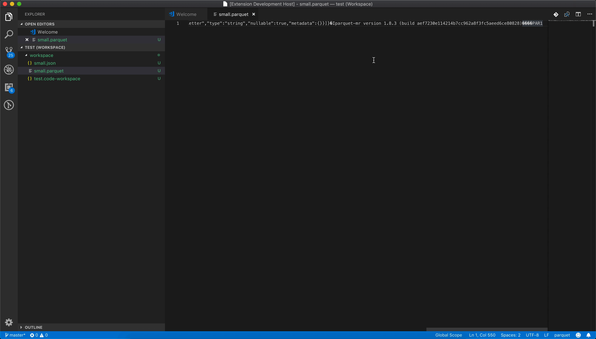

# parquet-viewer

Views [Apache Parquet](https://parquet.apache.org/) files as JSON.

Requires [parquet-tools](https://github.com/apache/parquet-mr/tree/master/parquet-tools).

## Features

When opening a Parquet file and choosing to "open it anyway" a JSON presentation of the file is displayed:

There's also a command to open the JSON presentation:

## Requirements

[parquet-tools](https://github.com/apache/parquet-mr/tree/master/parquet-tools) should be in your PATH.

### 0.1.0

Initial release 