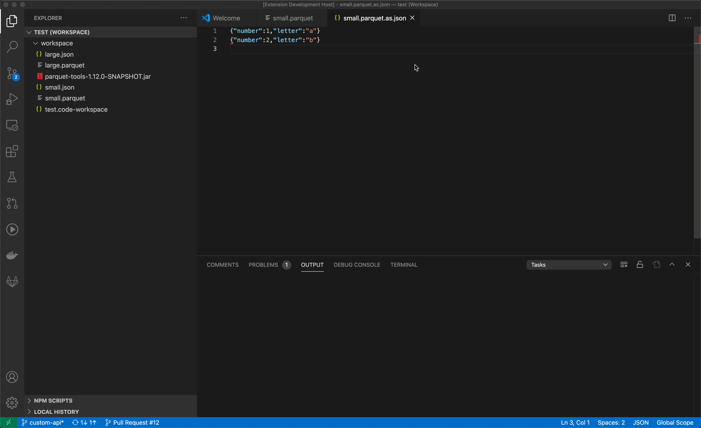
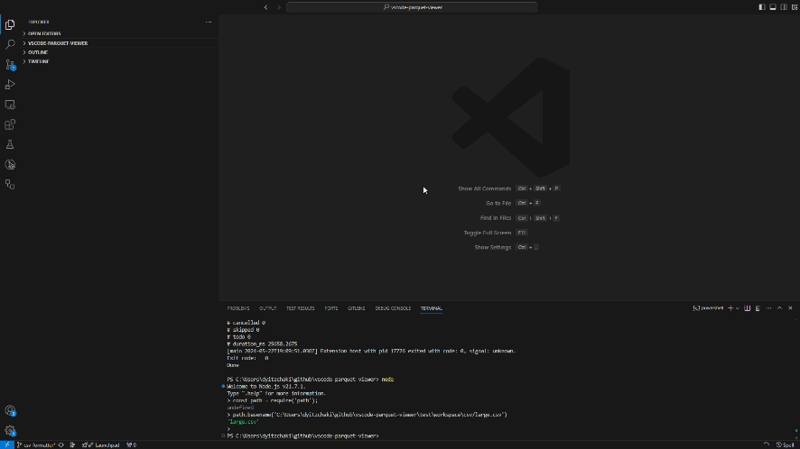
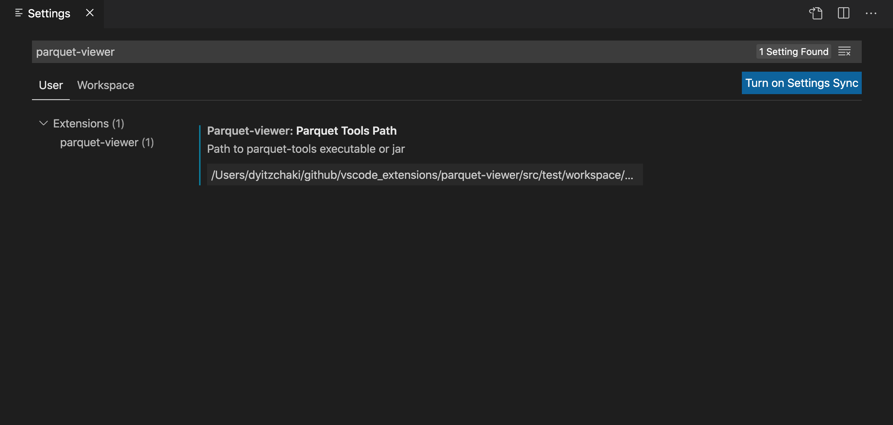

 

# parquet-viewer

Views [Apache Parquet](https://parquet.apache.org/) files as text (JSON or CSV).

## Features

When opening a Parquet file, a textual presentation of the file will open automatically:

After closing the textual view, it is possible to reopen it by clicking on the link in the parquet view.

## Backends

The extension supports different backends for parsing the files:

### arrow

This is the default backend. This backend is a thin wrapper around the [Apache Arrow C++](https://github.com/apache/arrow/tree/main/cpp) implementation and so should support latest and greatest parquet features.

## parquet-wasm

This backend uses the [parquet-wasm](https://kylebarron.dev/parquet-wasm) library which uses the "official" Rust implementations of Arrow and Parquet.

It support most compression algorithms besides LZ4, see https://kylebarron.dev/parquet-wasm/index.html#md:compression-support for details.

### parquets

This backend uses the [parquets](https://github.com/dvirtz/parquets) TypeScript library, which is a fork of the unmaintained [kbajalc/parquets](https://github.com/kbajalc/parquets) library with some bug fixes.

It only supports parquet version 1.0.0 with snappy compression.

## Format

The textual output can be either JSON or CSV based on the [parquet-viewer.format](#settings) setting.

## A richer view

After getting the textual representation, it's possible to use other extensions like [JSON Table Viewer](https://marketplace.visualstudio.com/items?itemName=lengmo.json-table-viewer) (requires settings `parquet-viewer.json.asArray`) or [Edit csv](https://marketplace.visualstudio.com/items?itemName=janisdd.vscode-edit-csv) to get a richer view of the data (e.g. in a table).

## Settings

The following setting options are available:

|name|default|description|
|----|-------|-----------|
|`parquet-viewer.backend`|`parquets`|Which backend to use for reading the files|
|`parquet-viewer.format`|`json`|textual output format|
|`parquet-viewer.logging.panel`|`false`|Whether to write diagnostic logs to an output panel|
|`parquet-viewer.logging.folder`|empty|Write diagnostic logs under the given directory|
|`parquet-viewer.logging.level`|info|Diagnostic log level. Choose between: `off`, `fatal`, `error`, `warn`, `info`, `debug` or `trace`|
|`parquet-viewer.json.space`|0|JSON indentation space, passed to `JSON.stringify` as is, see [mdn](https://developer.mozilla.org/en-US/docs/Web/JavaScript/Reference/Global_Objects/JSON/stringify#parameters) for details|
|`parquet-viewer.json.asArray`|`false`|Whether to format output JSON as one big array|
|`parquet-viewer.csv.separator`|`', '`|CSV separator|

## Notes

### Size limit

VSCode allows extensions to work on files smaller than 50MB.
If the data is larger, it will be truncated a message indicating that will be appended to the output.
See https://github.com/microsoft/vscode/issues/31078 for details.

## What's new

See [CHANGELOG.md](CHANGELOG.md)
